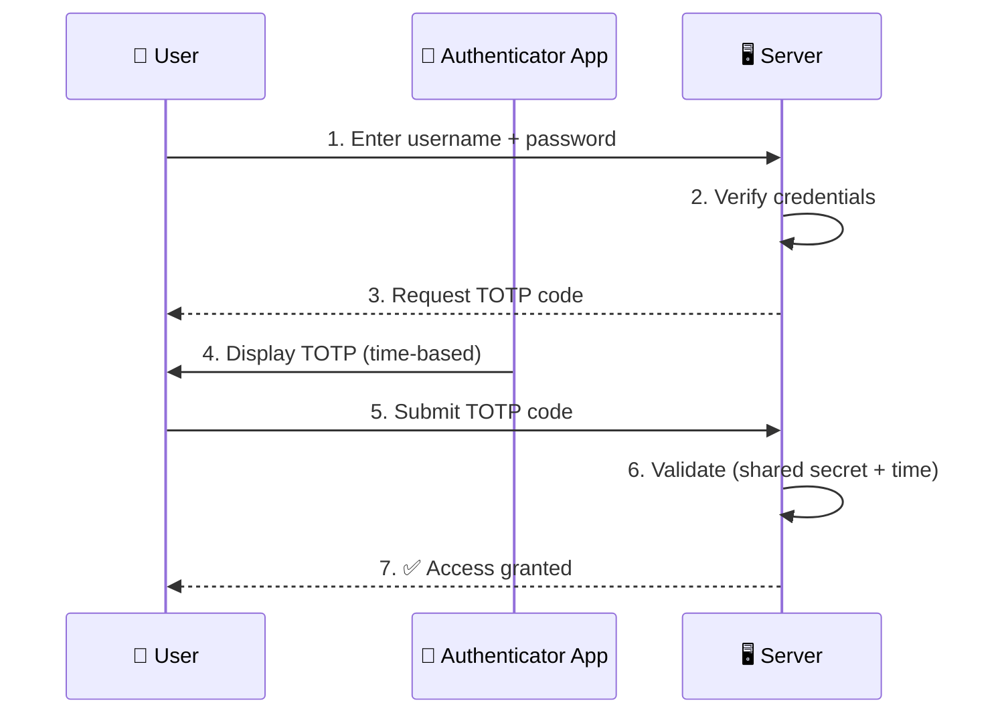

# Time-based One-Time Password (TOTP)

A **Time-based One-Time Password (TOTP)** is a security algorithm used as part of **two-factor authentication (2FA)** to protect against account attacks.

The mechanism is integrated into [dot-totp](https://github.com/dotkernel/dot-totp) to enhance security by requiring both a **password** and **an additional one-time code**.
Our implementation follows the industry standard of using an Authenticator app to generate temporary, unique 6-digit codes that change every 30 seconds.

## 2FA with TOTP Flow

Below is a simplified flow for the 2FA with a TOTP mechanism.

## Next Steps

[Install 2FA with dot-totp](../configuring-2fa-with-totp.md).
